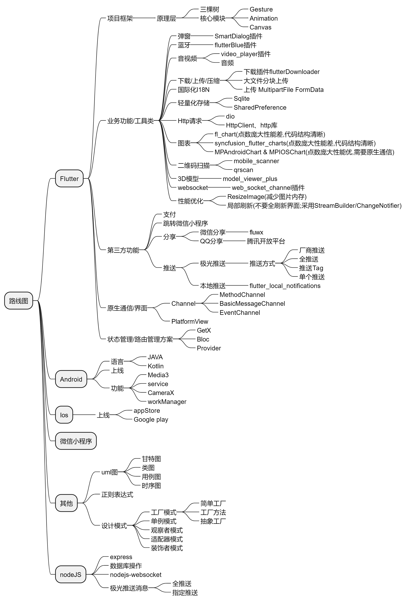

# bilibili_getx

接下来的学习计划（没计划确实不行，就跟个无头苍蝇🪰在乱撞）

| 计划内容                                                                                                                                                                                                               | 完成               | 时间                  |
|--------------------------------------------------------------------------------------------------------------------------------------------------------------------------------------------------------------------|------------------|---------------------|
| 学习Flutter[动画册子](https://juejin.cn/book/6965102582473687071/section/6982013736080900130?enter_from=course_center&utm_source=course_center)，更新[BLOG](https://blog.csdn.net/sheng_er_sheng/article/details/131258061) | 完成               | 2023.6.28-2023.6.30 |
| Flutter[手势册子](https://juejin.cn/book/6896378716427911181/section/6957884860782346275?enter_from=course_center&utm_source=course_center)，更新[BLOG](https://blog.csdn.net/sheng_er_sheng/article/details/131323197)   | 完成               | 2023.7.1-2023.7.5   |
| Flutter[Canvas](https://juejin.cn/book/6844733827265331214/section/6844733827214999565?enter_from=course_center&utm_source=course_center)，更新BLOG                                                                   | 进度丢失，重学（0/21）、延后 | 2023.7.6-2023.7.13  |
| Flutter内存优化方案搜集                                                                                                                                                                                                    |                  | 2023.6.28-～         |
| Android [应用数据和文件](https://developer.android.google.cn/guide/topics/data?hl=zh-cn)，更新[BLOG](https://blog.csdn.net/sheng_er_sheng/article/details/131348897)                                                         | 延后               | 2023.6.28-2023.7.5  |
| Android [Kotlin语法](https://book.kotlincn.net)，更新[BLOG](https://blog.csdn.net/sheng_er_sheng/article/details/130940725)                                                                                             | 至扩展              | 2023.6.28-2023.7.13 |
| 待补充                                                                                                                                                                                                                | /                | /                   |
|                                                                                                                                                                                                                    |                  |                     |
|                                                                                                                                                                                                                    |                  |                     |

**沉淀知识**
2023年6月28日更新

| 技术               | 进度                                                                                                                                                                                                                                                                                                                                                                                                                                                                                                                                                                                                                                                                              | 规划                                                                                                                                                                                                                                                                                                                          | 优先级（1-5） |
|------------------|---------------------------------------------------------------------------------------------------------------------------------------------------------------------------------------------------------------------------------------------------------------------------------------------------------------------------------------------------------------------------------------------------------------------------------------------------------------------------------------------------------------------------------------------------------------------------------------------------------------------------------------------------------------------------------|-----------------------------------------------------------------------------------------------------------------------------------------------------------------------------------------------------------------------------------------------------------------------------------------------------------------------------|----------|
| **Flutter篇***    | /                                                                                                                                                                                                                                                                                                                                                                                                                                                                                                                                                                                                                                                                               | /                                                                                                                                                                                                                                                                                                                           | /        |
| Flutter框架类知识     | [Flutter框架笔记](https://blog.csdn.net/sheng_er_sheng/article/details/131279994)                                                                                                                                                                                                                                                                                                                                                                                                                                                                                                                                                                                                   | 总结三棵树、学习完[手势册子](https://juejin.cn/book/6896378716427911181?enter_from=course_center&utm_source=course_center)、[动画册子](https://juejin.cn/book/6965102582473687071?enter_from=course_center&utm_source=course_center)、[Canvas册子](https://juejin.cn/book/6844733827265331214?enter_from=course_center&utm_source=course_center) | 1        |
| 弹窗               | [smartDialog](https://pub-web.flutter-io.cn/packages/flutter_smart_dialog/install)                                                                                                                                                                                                                                                                                                                                                                                                                                                                                                                                                                                              | 其他弹框                                                                                                                                                                                                                                                                                                                        | 5        |
| 蓝牙               | [flutterBlue](https://pub-web.flutter-io.cn/packages/flutter_blue)                                                                                                                                                                                                                                                                                                                                                                                                                                                                                                                                                                                                              | 实战                                                                                                                                                                                                                                                                                                                          | 5        |
| 音视频              | [video_player](https://pub-web.flutter-io.cn/packages/video_player);流媒体FLV(直播)                                                                                                                                                                                                                                                                                                                                                                                                                                                                                                                                                                                                  | 音频，音乐类软件                                                                                                                                                                                                                                                                                                                    | 2        |
| 上传               | FormData + MutilPartFile                                                                                                                                                                                                                                                                                                                                                                                                                                                                                                                                                                                                                                                        | 分块上传                                                                                                                                                                                                                                                                                                                        | 2        |
| 下载               | [flutter_downloader](https://pub-web.flutter-io.cn/packages/flutter_downloader)                                                                                                                                                                                                                                                                                                                                                                                                                                                                                                                                                                                                 | 断点继续上传                                                                                                                                                                                                                                                                                                                      | 2        |
| 压缩               | [light_compress](https://pub-web.flutter-io.cn/packages/light_compressor/install)                                                                                                                                                                                                                                                                                                                                                                                                                                                                                                                                                                                               | 无                                                                                                                                                                                                                                                                                                                           | 5        |
| 国际化I18N          | translations                                                                                                                                                                                                                                                                                                                                                                                                                                                                                                                                                                                                                                                                    | 无                                                                                                                                                                                                                                                                                                                           | 5        |
| 轻量化存储            | [sqlite](https://pub-web.flutter-io.cn/packages/sqflite)/[sharedpreference](shared_preferences)                                                                                                                                                                                                                                                                                                                                                                                                                                                                                                                                                                                 | 无                                                                                                                                                                                                                                                                                                                           | 5        |
| 网络请求             | [dio](https://pub-web.flutter-io.cn/packages/dio/install)                                                                                                                                                                                                                                                                                                                                                                                                                                                                                                                                                                                                                       | HttpClient/Http库                                                                                                                                                                                                                                                                                                            | 2        |
| 图表               | [fl_chart](https://pub-web.flutter-io.cn/packages/fl_chart)/[syncfusion_flutter_charts](https://pub-web.flutter-io.cn/packages/syncfusion_flutter_charts)/MPAndroidChart & MPIOSChart(点数很多时可以试试这个，flutter的chart插件，点数过多效果较差)                                                                                                                                                                                                                                                                                                                                                                                                                                                     | 无                                                                                                                                                                                                                                                                                                                           | 5        |
| 二维码扫描            | [mobile_scanner](https://pub-web.flutter-io.cn/packages/mobile_scanner)/[qrscan](https://pub-web.flutter-io.cn/packages/qrscan)                                                                                                                                                                                                                                                                                                                                                                                                                                                                                                                                                 | 无                                                                                                                                                                                                                                                                                                                           | 5        |
| 3D模型             | [model_viewer_plus](https://pub-web.flutter-io.cn/packages/model_viewer_plus)                                                                                                                                                                                                                                                                                                                                                                                                                                                                                                                                                                                                   | 无                                                                                                                                                                                                                                                                                                                           | 5        |
| websocket        | [web_socket_channel](https://pub-web.flutter-io.cn/packages/web_socket_channel)                                                                                                                                                                                                                                                                                                                                                                                                                                                                                                                                                                                                 | 无                                                                                                                                                                                                                                                                                                                           | 5        |
| 性能优化             | ResizeImage减少图片内存/局部刷新(Listenable/StreamBuilder)/绘制性能优化RepaintBoundary,作用是分隔开渲染对象                                                                                                                                                                                                                                                                                                                                                                                                                                                                                                                                                                                               | 继续补充                                                                                                                                                                                                                                                                                                                        | 1        |
| 支付               | 无                                                                                                                                                                                                                                                                                                                                                                                                                                                                                                                                                                                                                                                                               | 无                                                                                                                                                                                                                                                                                                                           | 5        |
| 分享               | 微信分享/QQ分享/                                                                                                                                                                                                                                                                                                                                                                                                                                                                                                                                                                                                                                                                      | 无                                                                                                                                                                                                                                                                                                                           | 5        |
| 微信小程序            | 跳转微信小程序 [fluwx](https://pub-web.flutter-io.cn/packages/fluwx)                                                                                                                                                                                                                                                                                                                                                                                                                                                                                                                                                                                                                   | 无                                                                                                                                                                                                                                                                                                                           | 5        |
| 极光推送             | 华为厂商推送/全推送/单个推送;极光推送(对接华为厂商通道)参考 [在Flutter中使用极光推送集成华为通道踩坑 - aquilahkj - 博客园 (cnblogs.com)](https://www.cnblogs.com/aquilahkj/p/15005775.html)  [(55条消息) flutter 极光推送 华为 厂商通道_qq_614149475的博客-CSDN博客](https://blog.csdn.net/qq_51633443/article/details/124044443?spm=1001.2101.3001.6650.7&utm_medium=distribute.pc_relevant.none-task-blog-2~default~BlogCommendFromBaidu~Rate-7-124044443-blog-118027993.pc_relevant_recovery_v2&depth_1-utm_source=distribute.pc_relevant.none-task-blog-2~default~BlogCommendFromBaidu~Rate-7-124044443-blog-118027993.pc_relevant_recovery_v2&utm_relevant_index=10)；后端实现推送[nodejs-jpush-async](https://www.bookstack.cn/read/jpush/45.md) | Tag推送                                                                                                                                                                                                                                                                                                                       | 2        |
| 本地推送             | [flutter_local_notifications](https://pub-web.flutter-io.cn/packages/flutter_local_notifications)                                                                                                                                                                                                                                                                                                                                                                                                                                                                                                                                                                               | 无                                                                                                                                                                                                                                                                                                                           | 5        |
| channel          | MethodChannel                                                                                                                                                                                                                                                                                                                                                                                                                                                                                                                                                                                                                                                                   | BasicMessageChannel/EventChannel                                                                                                                                                                                                                                                                                            | 5        |
| 原生界面             | AndroidView/UiKitView                                                                                                                                                                                                                                                                                                                                                                                                                                                                                                                                                                                                                                                           | 无                                                                                                                                                                                                                                                                                                                           | 5        |
| 状态管理             | GETX                                                                                                                                                                                                                                                                                                                                                                                                                                                                                                                                                                                                                                                                            | Provider/Bloc                                                                                                                                                                                                                                                                                                               | 2        |
| 预制动画             | 动画组件（flare、rive、lottie）                                                                                                                                                                                                                                                                                                                                                                                                                                                                                                                                                                                                                                                         |                                                                                                                                                                                                                                                                                                                             |          |
| 路由管理             | GETX(initRoute + getPages)                                                                                                                                                                                                                                                                                                                                                                                                                                                                                                                                                                                                                                                      |                                                                                                                                                                                                                                                                                                                             |          |
| Key              |                                                                                                                                                                                                                                                                                                                                                                                                                                                                                                                                                                                                                                                                                 |                                                                                                                                                                                                                                                                                                                             |          |
| Hero动画           |                                                                                                                                                                                                                                                                                                                                                                                                                                                                                                                                                                                                                                                                                 |                                                                                                                                                                                                                                                                                                                             |          |
| DevTools/Debug   |                                                                                                                                                                                                                                                                                                                                                                                                                                                                                                                                                                                                                                                                                 |                                                                                                                                                                                                                                                                                                                             |          |
| sizeAndViewsIn   |                                                                                                                                                                                                                                                                                                                                                                                                                                                                                                                                                                                                                                                                                 |                                                                                                                                                                                                                                                                                                                             |          |
| IM               |                                                                                                                                                                                                                                                                                                                                                                                                                                                                                                                                                                                                                                                                                 |                                                                                                                                                                                                                                                                                                                             |          |
| **Android篇**     | /                                                                                                                                                                                                                                                                                                                                                                                                                                                                                                                                                                                                                                                                               | /                                                                                                                                                                                                                                                                                                                           | /        |
| 编程语言             | JAVA                                                                                                                                                                                                                                                                                                                                                                                                                                                                                                                                                                                                                                                                            | [Kotlin学习BLOG](https://blog.csdn.net/sheng_er_sheng/article/details/130940725)                                                                                                                                                                                                                                              | 1        |
| 上线APP流程          | 无                                                                                                                                                                                                                                                                                                                                                                                                                                                                                                                                                                                                                                                                               |                                                                                                                                                                                                                                                                                                                             | 1        |
| Service          | [Service笔记](https://blog.csdn.net/sheng_er_sheng/article/details/130999373)                                                                                                                                                                                                                                                                                                                                                                                                                                                                                                                                                                                                     | [仿微信](https://blog.csdn.net/sheng_er_sheng/article/details/131128764)                                                                                                                                                                                                                                                       | 1        |
| Media3           | [Media3笔记](https://blog.csdn.net/sheng_er_sheng/article/details/131164987)                                                                                                                                                                                                                                                                                                                                                                                                                                                                                                                                                                                                      | [仿微信](https://blog.csdn.net/sheng_er_sheng/article/details/131128764)                                                                                                                                                                                                                                                       | 1        |
| workManager      | 无                                                                                                                                                                                                                                                                                                                                                                                                                                                                                                                                                                                                                                                                               |                                                                                                                                                                                                                                                                                                                             | 1        |
| 应用存储数据           | [应用存储数据笔记](https://blog.csdn.net/sheng_er_sheng/article/details/131348897)                                                                                                                                                                                                                                                                                                                                                                                                                                                                                                                                                                                                      | 继续补充                                                                                                                                                                                                                                                                                                                        | 1        |
| CameraX          | [CameraX例子BLOG](https://blog.csdn.net/sheng_er_sheng/article/details/130923458)                                                                                                                                                                                                                                                                                                                                                                                                                                                                                                                                                                                                 |                                                                                                                                                                                                                                                                                                                             | 1        |
| **IOS篇**         | /                                                                                                                                                                                                                                                                                                                                                                                                                                                                                                                                                                                                                                                                               | /                                                                                                                                                                                                                                                                                                                           | /        |
| 上线               | appStore                                                                                                                                                                                                                                                                                                                                                                                                                                                                                                                                                                                                                                                                        | 上线AppStore流程/GooglePlay流程                                                                                                                                                                                                                                                                                                   | 1        |
| 原生Swift          | 无                                                                                                                                                                                                                                                                                                                                                                                                                                                                                                                                                                                                                                                                               |                                                                                                                                                                                                                                                                                                                             | 1        |
|                  |                                                                                                                                                                                                                                                                                                                                                                                                                                                                                                                                                                                                                                                                                 |                                                                                                                                                                                                                                                                                                                             |          |
| **项目管理篇**        | /                                                                                                                                                                                                                                                                                                                                                                                                                                                                                                                                                                                                                                                                               | /                                                                                                                                                                                                                                                                                                                           | /        |
| 原型               | Axure/墨刀                                                                                                                                                                                                                                                                                                                                                                                                                                                                                                                                                                                                                                                                        | 无                                                                                                                                                                                                                                                                                                                           | 2        |
| uml图             | [甘特图](https://zhuanlan.zhihu.com/p/271043355)/类图/时序图/用例图                                                                                                                                                                                                                                                                                                                                                                                                                                                                                                                                                                                                                        | 继续补充                                                                                                                                                                                                                                                                                                                        | 2        |
|                  |                                                                                                                                                                                                                                                                                                                                                                                                                                                                                                                                                                                                                                                                                 |                                                                                                                                                                                                                                                                                                                             |          |
| **其他**           | /                                                                                                                                                                                                                                                                                                                                                                                                                                                                                                                                                                                                                                                                               | /                                                                                                                                                                                                                                                                                                                           | /        |
| 正则表达式            | 无                                                                                                                                                                                                                                                                                                                                                                                                                                                                                                                                                                                                                                                                               | 无                                                                                                                                                                                                                                                                                                                           | 5        |
|                  |                                                                                                                                                                                                                                                                                                                                                                                                                                                                                                                                                                                                                                                                                 |                                                                                                                                                                                                                                                                                                                             |          |
|                  |                                                                                                                                                                                                                                                                                                                                                                                                                                                                                                                                                                                                                                                                                 |                                                                                                                                                                                                                                                                                                                             |          |
| **NodeJs篇**      | /                                                                                                                                                                                                                                                                                                                                                                                                                                                                                                                                                                                                                                                                               | /                                                                                                                                                                                                                                                                                                                           | /        |
| express          | [仿微信](https://blog.csdn.net/sheng_er_sheng/article/details/131128764)                                                                                                                                                                                                                                                                                                                                                                                                                                                                                                                                                                                                           | 无                                                                                                                                                                                                                                                                                                                           | 5        |
| nodejs-websocket | [仿微信](https://blog.csdn.net/sheng_er_sheng/article/details/131128764)                                                                                                                                                                                                                                                                                                                                                                                                                                                                                                                                                                                                           | 无                                                                                                                                                                                                                                                                                                                           | 5        |
|                  |                                                                                                                                                                                                                                                                                                                                                                                                                                                                                                                                                                                                                                                                                 |                                                                                                                                                                                                                                                                                                                             |          |
| **项目开发经验**       | /                                                                                                                                                                                                                                                                                                                                                                                                                                                                                                                                                                                                                                                                               | /                                                                                                                                                                                                                                                                                                                           | /        |
| 项目目录结构清晰，模块化清晰   | 封装思想                                                                                                                                                                                                                                                                                                                                                                                                                                                                                                                                                                                                                                                                            |                                                                                                                                                                                                                                                                                                                             |          |
| 设计模式             | [设计模式笔记](https://blog.csdn.net/sheng_er_sheng/article/details/131181391)                                                                                                                                                                                                                                                                                                                                                                                                                                                                                                                                                                                                        | 继续补充                                                                                                                                                                                                                                                                                                                        | 2        |

**2022年11月30日**

华为通道（极光推送）

直播界面初步

QQ分享、微信分享、微信小程序

动态

**2022年10月27日**
flare动画 一些好看的rive动画 switch https://rive.app/community/2726-5857-switch-demo/
爱心按钮、通知按钮 https://rive.app/community/3189-6916-animated-icon-pack/
进度条 https://rive.app/community/3264-6879-tree-loading-bar/

点击视频左上角的三点更多按钮，有视频下载功能

**2022年9月22日**

不更新不行啦，虽然代码一直在更新，但还得做些视频哈哈，否则对不起我这60个粉丝哈哈

这次距离上次更新快三个星期了，不咕不咕

主要更新了

1直播房间的获取，内容还没有

2nestedscrollview嵌套tabview，内容缓存

3语言切换

当然有些效果我做不到，我后面看看能不能改改吧（比如这个子tab，因为nestedscrollview里面不能有controller，否则与顶部内容就无法联动）

4最主要是这个视频界面，之前我采用的是chewie这个组件，但是很多功能，还是自己做的比较好，所以我把那部分的内容全部去掉了，目前就用video_player，重新把视频这块内容重做了一遍。

5还有弹幕这块，之前也是做了一版，但是很卡，原因是我是模拟发弹幕的过程，每条弹幕都有一个controller，这样的话，卡的不行。所有弹幕这块我重做了，这次就六条轨道，使用singlechildscrollerview来控制滑动至底部，这样就只需要绘制横向的列表，而且还能与视频播放暂停快进联动起来。

但是顶部弹幕和底部弹幕目前还没有做，之前那一版是有的，之后再添加上去。

视频内容的接口，目前无法用了，之前的方法获取原视频是可以用的，但后来就不太行了，都是403了已经，不知道是不是我的方法有问题

6会员购界面顶部滚动监听改了下，是不是不那么卡了，getX的update() 能少用就少用，特别是监听这种，关键的地方update()一下就可以啦

有些接口，模拟器上抓来的基本是grpc的，这个问题我一直就解决不了，即便是有proto，也知道传的参数和数值，但是就是返回为null，所有我就不太想搞了。比如动态界面等等，拿不到数据就没办法进行下去。json的就好弄

之后的话，原来那版是有直播界面的，我还没有用getX搬过来，还有就是发布视频的那块，是要与原生建立通信的，目前也没搬过来。竖屏的视频，视频内的上侧的工具栏

ok，差不多是这样的啦

**2022年9月11日**

【我宁可痛苦，也不要麻木】[20年前的农村女性，竟狠狠 戳中了我的心_哔哩哔哩_bilibili](https://www.bilibili.com/video/BV1KP41157tb?spm_id_from=333.337.search-card.all.click&vd_source=9577d8766a1c3a48233a9f8f750633c4)

**2022年9月4日更新**

昨天写了下会员购这一块 先看一下效果 头部是下拉会展开，上滑会收缩的效果 再是下面的的轮播图，水平滑动的列表 最后一部分是瀑布流的布局 整体效果看起来是这样的 感觉还是有些卡顿的

用这个getX来管理，先去安装一个插件GETX
new一个GET，会生成下面的四个文件，state用来放共享的变量、bindind可以懒加载这个界面，也可以说是注册，logic放逻辑性的操作，比如上下滑动，更改某些控件的属性，view就是界面部分

获取b站的数据，先去打开一个模拟器，打开抓包的工具，设置代理。获取到json的数据之后，看下那些数据是需要改动的，做好之后，做网络请求，一般来说可以用postman来测试接口

处理完之后就在urlMap和request那里把网络请求的方法给写上 在logic里面的onReady或onInit生命周期中写上，销毁则在onCancel。区别见GetX状态管理之
GetxController
生命周期详解[GetX状态管理之 GetxController 生命周期详解 - 知乎 (zhihu.com)](https://zhuanlan.zhihu.com/p/445371503#:~:text=其实就是将
onReady 方法作为回调，当 onInit 完成之后的一帧来调用 onInit,。 这也就是我们上一篇说的， onReady 会在 onInit 完成后一帧后调用。)

整体的结构要清晰一些

整个项目结构，asset，就是存放一些静态的数据（图片、网页、json数据）等，flutter主目录的分为core和ui主目录。I18n为国际化，model为所有用到的模型，这个notifier是视频播放那块，之前用的还是provider。下面是这个proto，主要是用在视频弹幕，service为网络请求，有个比较重要的cors.dart，是本地代理。sharedpreference就是数据的持久化存储。

ui就是放的是界面和共用的widget，shared为共享的函数。入口main.dart。

整个目录还有Android、Windows、Web。涉及原生。

既然是个跨平台，那么在同一个界面，在不同的平台，就能显示不同的界面。而在同一个平台，不同机型、不同的屏幕大小，要屏幕适配。不同平台要功能适配。Platform，kIsweb

pubspec.yaml里面写依赖的插件

推荐一些网站

[Instantly parse JSON in any language | quicktype](https://app.quicktype.io/) 转换为model

[Dart packages (flutter-io.cn)](https://pub.flutter-io.cn/) 搜索插件

开发软件Android Studio或VSCode

抓包工具Claris 或者 Fiddler

分析接口postman

分析grpc（BloomRPC或者postman）

还有请求数据一些细节的地方看这个[bilibili-API-collect/dynamic.md at master · SocialSisterYi/bilibili-API-collect · GitHub](https://github.com/SocialSisterYi/bilibili-API-collect)
比如参数的sign是怎么来的，appkey，appkeyhash，这里都有提到。还有proto文件，找一下